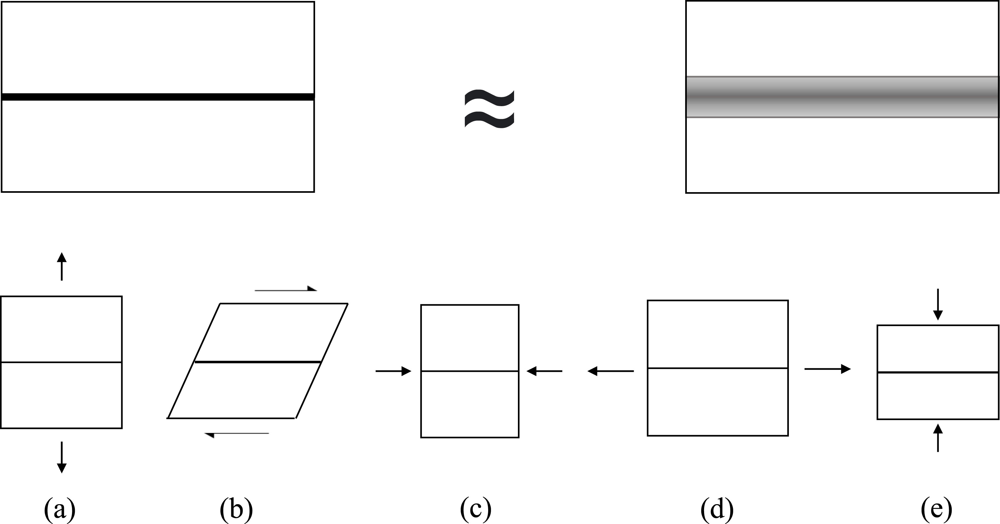
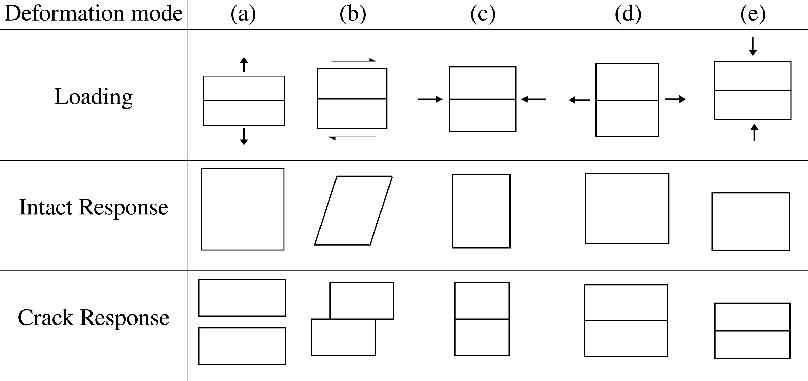

# Numerical Implementation of Crack Growth Using a Proposed Physically Realistic Fracture Model in FEniCS

## Overview
This repository contains numerical solutions for modeling crack behavior using the Finite Element Method (FEM), implemented with the open-source FEniCS library.

## Features
- **Energy-Minimizing Deformations**: Computation of energy-minimizing deformations for scenarios referred to as a "frozen crack".
- **Crack Growth Simulation**: Simulation of crack growth under quasi-static external loading conditions, allowing both phase field and displacement fields to evolve in order to minimize energy.
- **Irreversibility Constraint**: Implementation of constraints to prevent the healing of cracks, even when load conditions are reversed.

## Problem Classes
1. **Frozen Crack Problem**: 
   - Calculation of deformations with a static phase field using the Dolfin Adjoint library to minimize energy under complex load conditions.
2. **Fully-Coupled Crack Growth Problem**: 
   - Alternating minimization between displacement and phase fields under external loads, employing an iterative strategy to ensure convergence.

## Methodology
The phase field and displacement fields are approximated using standard piecewise linear elements. The computational process includes:
- Alternating minimization steps over displacement and phase fields at each load step.
- Ensuring convergence through iterative updates until a predetermined convergence criterion is achieved.
- Applying a critical threshold for the phase field to enforce the irreversibility of crack growth.

## Phase-Field Regularization
- Utilization of a nondimensionalized length scale for the phase-field regularization parameter.
- Employment of a mesh that is sufficiently refined to accurately resolve interfaces, based on the nondimensionalized scale.

## Overview of the Proposed Fracture Model

Below figure illustrates our overall methodology for modeling crack. The key objective is to derive an effective crack energy such that a regularized crack volume responds similarly to an idealized sharp crack. This is accomplished through the distinct handling of the kinematics associated with each deformation mode depicted in the figure.

We systematically separate the kinematics associated with each deformation mode as shown in below figure. Each mode is then treated appropriately to align the behavior of a regularized crack volume with that of an idealized sharp crack.

## References
This code has been utilized for calculations in the following publication:
[ScienceDirect Article on Crack Behavior](https://www.sciencedirect.com/science/article/pii/S0022509622001843)
For a detailed explanation of the model development, refer to the aforementioned paper.
